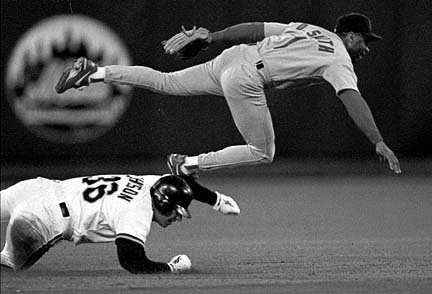
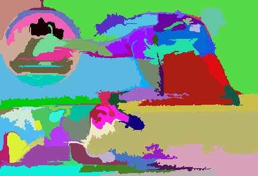
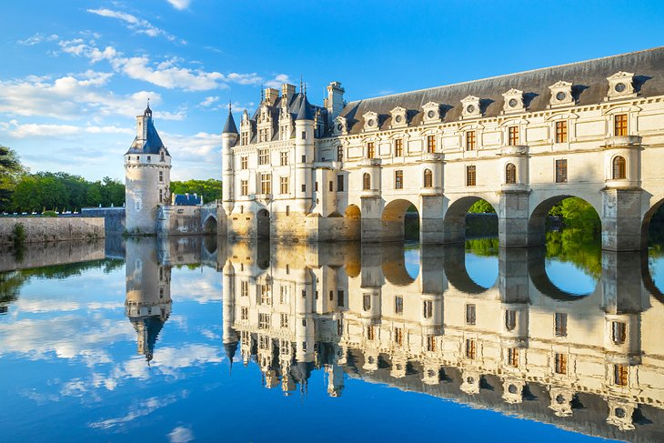
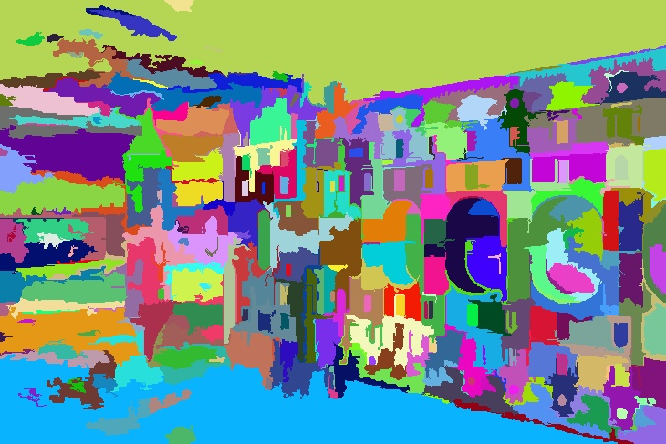
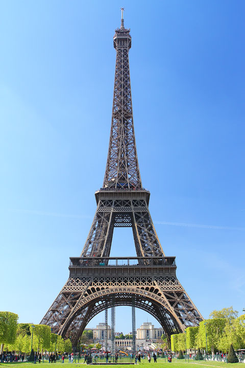
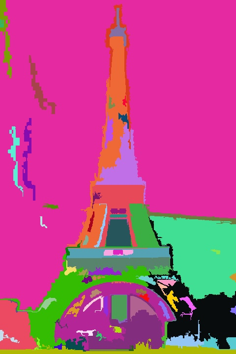
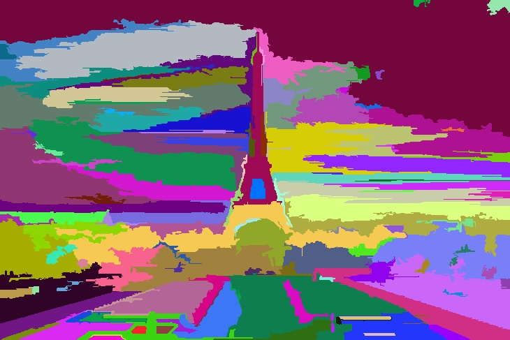
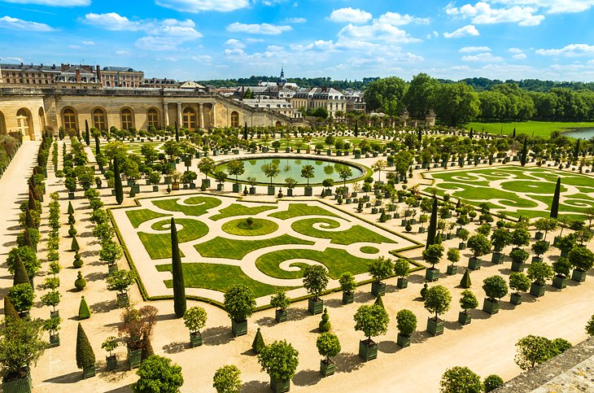
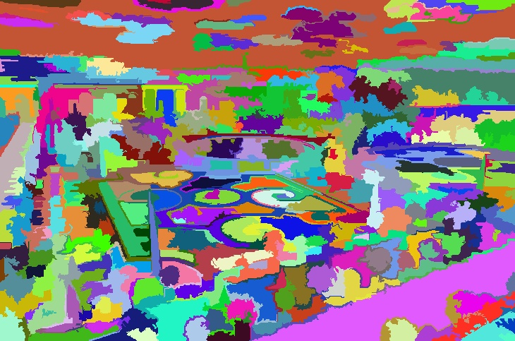

# Graph-Based-Image-Segmentation
This project is an attempt to implement the research paper: [Efficient Graph Based Image Segmentation](http://people.cs.uchicago.edu/~pff/papers/seg-ijcv.pdf).
Entire bottom-up implementation done by the author (post-processing and rgb-color difference ideas taken from [here](http://cs.brown.edu/people/pfelzens/segment/)). I have also written an [article](https://iammohitm.github.io./Graph-Based-Image-Segmentation/) summarizing and explaining the research paper
 
### Requirements
1. C++ standard 17a
2. OpenCV

### Building and Execution
Run the commands in your project directory
```
mkdir build
cd build
cmake ../source
cmake --build .
```

Execute the program while in build directory
```
.\ImageSegment inputImage outputDir colorSpace k(float) sigma(float) minSize(int)
```
### Results
| Original Image                                      | Results                                                                                                             |
|--------------                                       |-------- |
|             | sigma = 1.5 k = 1000 min = 100 grayscale         |
|||
|| sigma = 0.8 k = 1000 min = 100 grayscale     |
|||
|                | sigma = 1.0 k = 1000 min = 100 RGB                         |
|||
|     | sigma = 1.0 k = 800 min = 100 RGB                |
|||
||sigma = 1.0 k = 750 min = 100 Grayscale              |


### TODO
- [ ] Fix Relative Paths<br>
- [x] Add cmake installation
- [x] Use smart pointers in place of raw pointers
- [ ] Validate pointer parameters to functions (prefer passing by reference instead) 

### License
[GNU-GPL](https://choosealicense.com/licenses/gpl-3.0/)

### Note
The files in the Results folder are named in format : *filename-[gray|rgb]-k{value}-{sigmaValue}-min{minimumComponents}.jpg*


